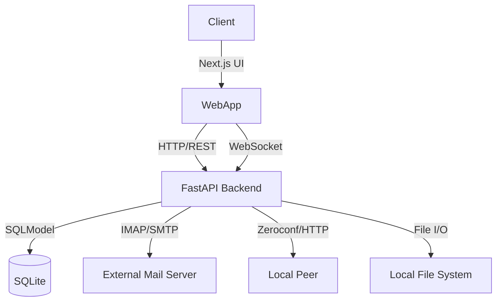

# OpenMail Hub - API & Database Design

## Database Models (SQLModel)

### Email
```python
class Email(SQLModel, table=True):
    id: str = Field(primary_key=True)  # Message-ID or IMAP UID
    subject: str
    from_addr: str
    to_addr: str
    date: datetime
    snippet: str
    body_text: Optional[str] = None
    body_html: Optional[str] = None
    folder: str = "INBOX"
    is_read: bool = False
```

### Attachment
```python
class Attachment(SQLModel, table=True):
    id: Optional[int] = Field(default=None, primary_key=True)
    email_id: str = Field(foreign_key="email.id")
    filename: str
    content_type: str
    file_path: str
    size: int
    is_image: bool = False
```

### LocalDropPeer
```python
class LocalDropPeer(SQLModel, table=True):
    id: str = Field(primary_key=True) # Device ID
    name: str # Hostname
    ip: str
    port: int
    last_seen: datetime
```

## API Endpoints

### Authentication
- `POST /auth/login`
    - Body: `{ "email": "...", "password": "...", "imap_server": "...", "smtp_server": "..." }`
    - Returns: Session Token (stored in memory/securely)

### Mail
- `GET /mail/inbox`
    - Query: `limit=20`, `offset=0`
    - Returns: `List[Email]` (snippets only)
- `GET /mail/{email_id}`
    - Returns: `Email` (full content)
- `POST /mail/send`
    - Body: `{ "to": "...", "subject": "...", "body": "..." }`

### Media
- `GET /media/images`
    - Returns: `List[Attachment]` (where is_image=True)

### LocalDrop
- `POST /localdrop/scan`
    - Trigger peer discovery immediately
- `GET /localdrop/peers`
    - Returns active peers
- `POST /localdrop/send`
    - Body: `{ "peer_id": "...", "files": [...] }`
- `WS /localdrop/ws`
    - WebSocket for progress updates and file streaming

## Architecture Patterns
- **Sync Worker**: A background task (asyncio) that runs every X seconds to fetch new emails from IMAP and update SQLite.
- **Media Indexer**: On email fetch, if attachments exist, download specific types (images) to `apps/api/media_vault/` and index in DB.

## Architecture Diagram


