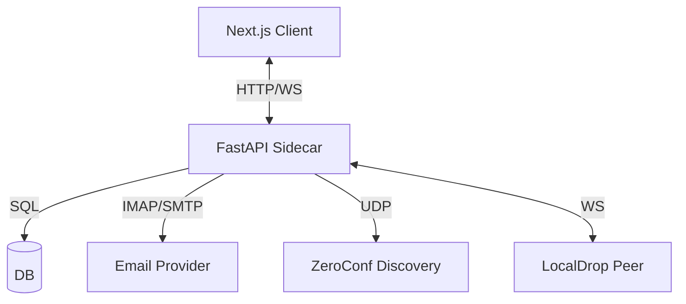
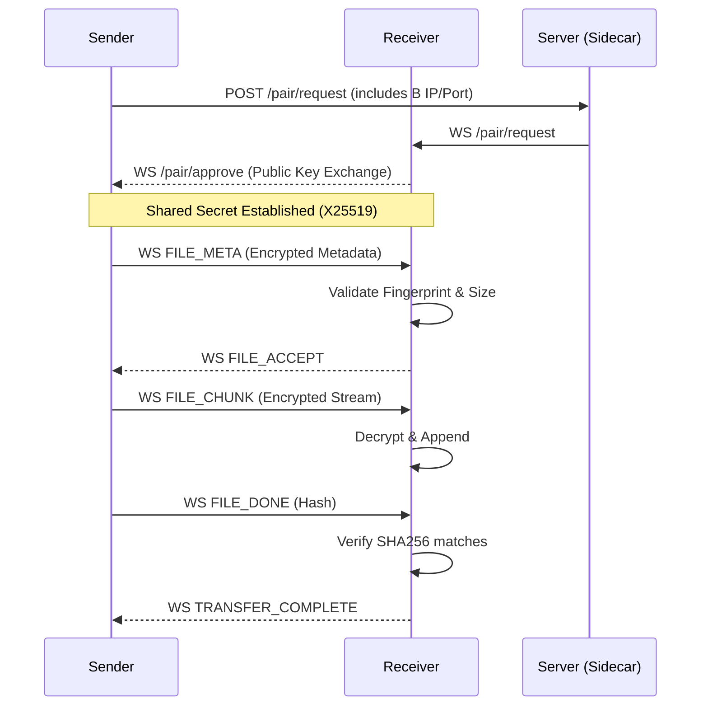

# OpenMail Hub - Design System & UI Specifications

## 1. Design Philosophy
**"Expensive, Airy, Kinetic"**
The interface should feel like a premium tool for professionals. It must be faster than Gmail and cleaner than Outlook.

## 2. Color Palette
- **Background**: `bg-white` (Main), `bg-slate-50` (Sidebar/Panels).
- **Primary Action**: `bg-blue-600` (Superhuman Blue).
- **Text**: 
  - Primary: `text-slate-900` (Not pure black).
  - Secondary: `text-slate-500`.
  - Muted: `text-slate-400`.
- **Borders**: `border-slate-100` (Subtle).
- **Accents**: 
  - Error: `text-red-600`.
  - New/Unread: `bg-blue-50 text-blue-700`.

## 3. Typography
- **Font Family**: `Inter` (Next.js default) or system sans-serif.
- **Hierarchy**:
  - **H1 (Logo)**: `text-xl font-bold tracking-tight`.
  - **H2 (Page Title)**: `text-lg font-semibold`.
  - **Body**: `text-sm` (Standard for data density).
  - **Metadata**: `text-xs font-medium`.

## 4. Layout Rules
- **Sidebar**: Fixed width (`w-64`), frosted glass effect (`backdrop-blur-xl`).
- **Inbox List**: Standard list layout, comfortable density (`p-4`).
- **Reading Pane**: Clean typography, max-width read container.
- **Modals**: Centered, minimal shadows (`shadow-2xl`), clean backdrops.

## 5. Component Behavior (UI Agent Mandates)
- **Hover Effects**: All interactive elements must have a `hover:bg-slate-50` or similar state.
- **Transitions**: `transition-all duration-200` on buttons and cards.
- **Feedback**: Loading spinners (`animate-spin`) on all async actions.
- **Empty States**: Never show blank screens; use illustrations or icons for empty states.

## 6. Components (shadcn/ui)
We strictly use the following components:
- `Button` (Ghost for nav, Default for primary).
- `Dialog` (Compose, Settings).
- `Input` / `Textarea` (Forms).
- `Card` (MediaVault, LocalDrop Peers).
- `Skeleton` (Loading states).

## 7. Architecture Diagrams

### System Overview

### LocalDrop Flow

